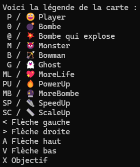
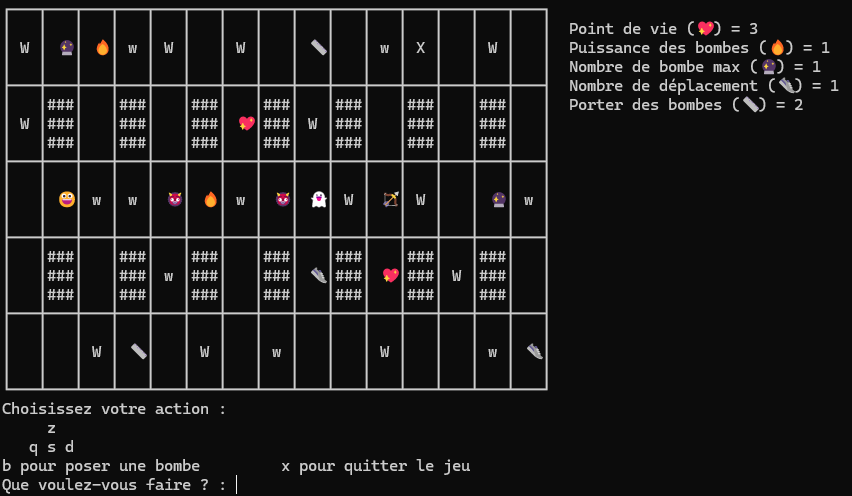

# Bomberman - INFO0402 C++

Projet de C++, visant a recréer le jeu Bomberman dans un terminal.

## Lancement
Lancement du jeu grace au `makefile`

Compiler :
```bash
make
```

Lancer le jeu :
```bash
./System
```

## Règle
[Règle du jeu](/code/regles.md)

## Légende


## Jeu


***
**Date**: 10/02/2022